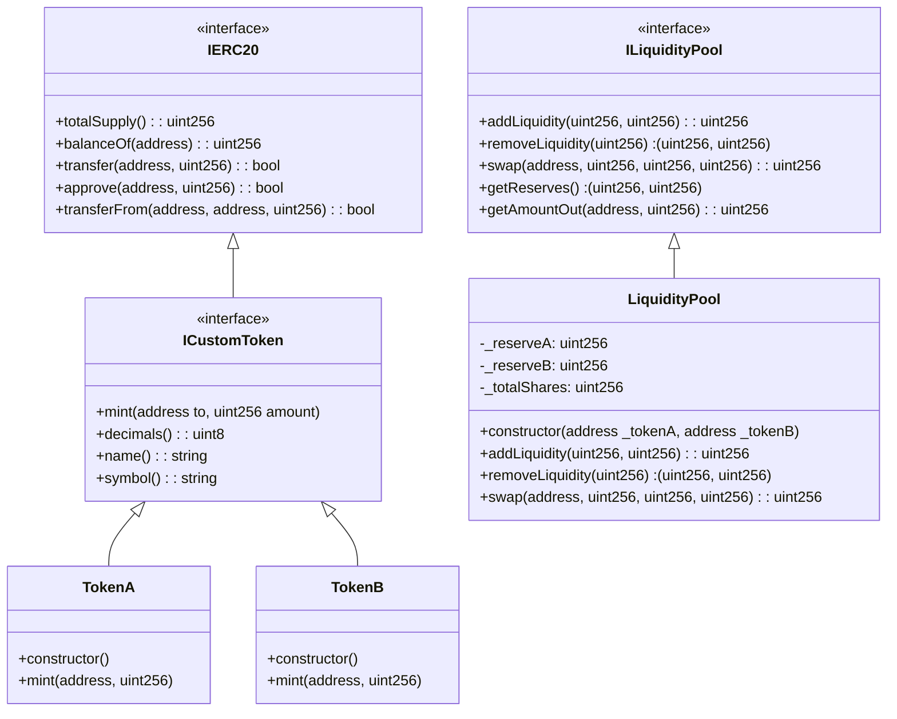
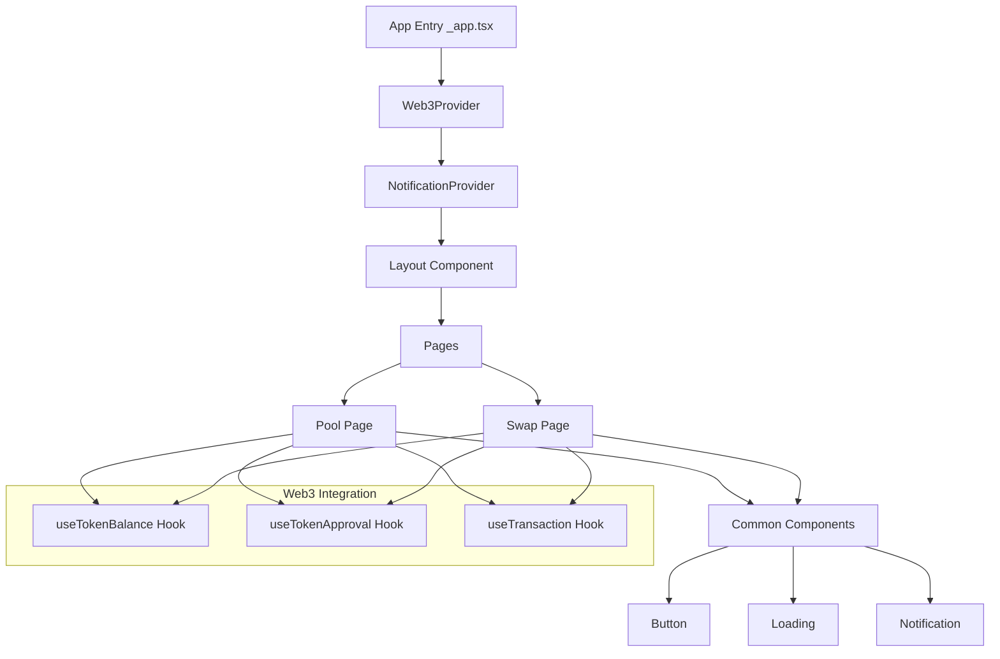

# DeFi Liquidity Pool

A decentralized liquidity pool application enabling users to swap tokens and manage liquidity. Built with Solidity smart contracts and a Next.js frontend, leveraging the Hardhat development environment.

## Table of Contents

- [Architecture](#architecture)
  - [Smart Contract Architecture](#smart-contract-architecture)
  - [Frontend Architecture](#frontend-architecture)
- [Setup](#setup)
- [Features](#features)
- [Technical Details](#technical-details)
- [Testing](#testing)

## Architecture

### Smart Contract Architecture

The smart contract architecture consists of three main components:



#### Token Contracts (TokenA.sol & TokenB.sol)

- ERC20 standard tokens using OpenZeppelin implementation.
- Features:
  - Minting functionality.
  - Standard token operations (transfer, approve).
  - Owner-controlled minting.

#### Liquidity Pool Contract (LiquidityPool.sol)

- Core AMM (Automated Market Maker) functionality.
- Features:
  - Liquidity provision and removal.
  - Token swapping with constant product formula.
  - Fee calculation and collection.
  - Emergency pause mechanism.
- Security Measures:
  - Reentrancy guard.
  - Overflow protection.
  - Slippage control and transaction deadlines.

### Frontend Architecture



#### Core Components

- **Layout.tsx**: Main application layout.
- **Header.tsx**: Navigation and wallet connection.
- **Button.tsx**: Reusable button component.
- **Loading.tsx**: Manages loading states.
- **NotificationContainer.tsx**: Handles transaction notifications.

#### Feature Components

- **SwapComponent.tsx**: Interface for token swapping.
- **PoolComponent.tsx**: Interface for managing liquidity.

#### Custom Hooks

- **useTokenBalance**: Updates token balances.
- **useTokenApproval**: Manages token approval workflow.
- **useTransaction**: Tracks transaction states.

## Setup

1. Clone the repository:

   ```bash
   git clone https://github.com/yourusername/defi-liquidity-pool.git
   cd defi-liquidity-pool
   ```

2. Install dependencies:

   ```bash
   npm install
   ```

3. Configure environment variables:

   ```bash
   cp .env.example .env
   ```

   Update `.env` with your configuration:

   ```env
   BASE_SEPOLIA_RPC_URL=your_rpc_url
   PRIVATE_KEY=your_private_key
   BASESCAN_API_KEY=your_api_key
   ```

4. Deploy contracts:

   ```bash
   npx hardhat run scripts/deploy.js --network baseSepolia
   ```

5. Start development server:
   ```bash
   npm run dev
   ```

## Features

### Token Swapping

- Automatic price calculation using AMM formula.
- Slippage protection and real-time price updates.

### Liquidity Management

- Add/remove liquidity with paired tokens.
- Real-time pool share updates.

### User Interface

- Wallet integration with RainbowKit.
- Mobile-responsive design with transaction notifications.

## Technical Details

### Project Structure

```
├── contracts/
│   ├── interfaces/
│   ├── Token.sol
│   └── LiquidityPool.sol
├── src/
│   ├── components/
│   ├── hooks/
│   ├── contexts/
│   ├── config/
│   └── pages/
└── test/
    ├── Token.test.js
    └── LiquidityPool.test.js
```

### Smart Contract Security

- Reentrancy protection.
- Access control mechanisms.
- Input validation and emergency pause functionality.

### Frontend Implementation

- React and TypeScript.
- TailwindCSS for styling.
- Wagmi for Web3 interactions.

## Testing

Run the test suite:

```bash
npx hardhat test
```
